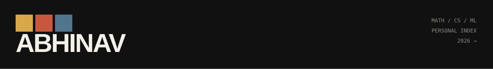

  <kbd>MATH</kbd>
  <kbd>CS</kbd>
  <kbd>ML</kbd>
  <kbd>ECON</kbd>

  <a href="https://4nav.github.io">website</a>
  &nbsp;·&nbsp;
  <a href="mailto:4nav.dev@gmail.com">email</a>

### lately

trying to understand things I probably don't need to.

currently somewhere between mathematics, computer science,
machine learning, and economics.

<h3>things i like</h3>

  <code>math</code> · <code>pokemon</code> · <code>machine learning</code> ·
  <code>video games</code> · <code>economics</code> ·
  <code>competitive programming</code> · <code>philosophy</code> · <code>building useless things</code>

### somewhere on my computer

<pre>
├── projects/
├── inbox/
├── side-quests/

<code>└─unsolved/</code>

    things I've been thinking about lately.

    Sometimes I can explain exactly why something works
    without feeling like I understand why it should work.
    
    How has the Common App survived this long if so much
    of its security depends on everyone agreeing not to be funny?
    
    [unfinished thought]
    Maybe building something useless is only useless if
    you already knew it was useless.

→ <a href="https://www.youtube.com/watch?v=dQw4w9WgXcQ">open the full notes</a>

</pre>

  <a href="mailto:4nav.dev@gmail.com">reaching out</a> is left as an exercise to the reader.

